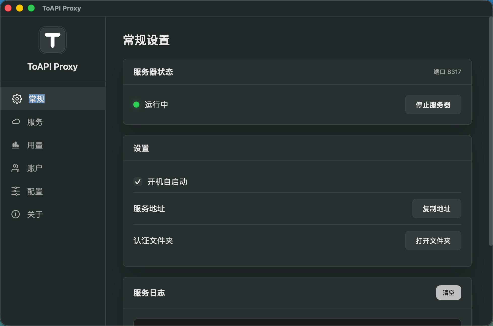
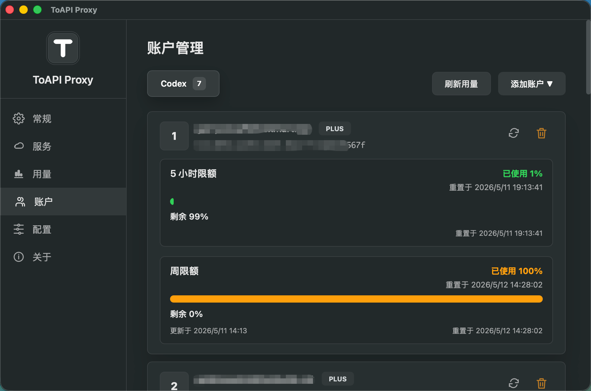
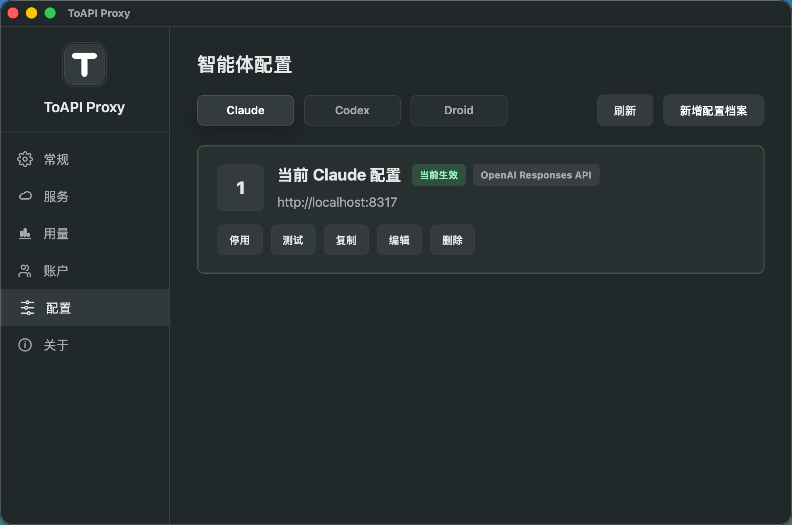

# TOAPIPROXY

TOAPIPROXY 是一款基于 Tauri 构建的本地 AI API 代理桌面应用。它在 CLIProxyAPI 基础上提供桌面界面，用于启动本地代理、连接账号、管理账号模式、查看本机请求用量，并配置 Claude、Codex、Droid 等智能体。

**仅限个人学习使用，不得商用，bug 自负**

## 说明

本项目是在 CLIProxyAPI 这个开源项目的基础上增加桌面 UI，主要方便非程序员使用。各位如果是程序员，发现有 bug 可以自行修改，也不用提 pr，没时间维护，我只有发现明显 bug，花费时间少的时候才会过来看看，顺手修一份。需要拼车教程，访问：[https://bokecity.com/book/95?from=free](https://bokecity.com/book/95?from=free)

## 功能特性

### 核心功能

- **本地代理服务** - 默认在本机 `8317` 端口提供代理地址，CLIProxyAPI 后端由应用自动管理
- **服务管理** - 当前界面重点管理 Codex 服务，代理核心保留 Claude、Codex、Gemini、Copilot、Qwen、Kiro、Antigravity 等服务能力
- **OAuth 认证管理** - 提供浏览器认证、当前 Codex 导入、认证文件夹打开等操作
- **账号模式管理** - 支持轮询模式和首选账号模式；点击「编辑设置」后进入编辑态，点击「保存设置」后才生效
- **用量统计** - 左侧「用量」页面展示今天、7 天、30 天、全部范围内的请求、Tokens、失败数、来源、API 和最近请求
- **智能体配置** - 「配置」页面支持 Claude、Codex、Droid；Codex 配置档案可写入 Codex CLI 的本地配置文件

### 特色功能

- **Thinking 代理** - 自动处理 Claude 模型的 `thinking` 参数，支持 `claude-*-thinking-*` 格式的模型名称转换
- **石墨灰界面** - 主界面使用黑白灰配色，侧边栏、按钮、Logo 统一为低对比石墨灰视觉
- **开机自启动** - 支持系统启动时自动运行
- **系统托盘** - 支持托盘显示、隐藏窗口、启动或停止代理服务、复制服务地址

### 跨平台

- Windows (x64)
- macOS (Intel & Apple Silicon)
- Linux

## 界面预览

### 首页



### 账号



### 配置



## 系统要求

- Windows 10/11 (x64)
- macOS 10.15+ (Intel 或 Apple Silicon)
- Linux (主流发行版)

## 安装

### Windows

下载 `TOAPIPROXY_x.x.x_x64-setup.exe` 安装包，双击运行即可。

### macOS / Linux

```bash
# 下载对应平台的安装包
# macOS: TOAPIPROXY_x.x.x_x64.dmg 或 .app.tar.gz
# Linux: TOAPIPROXY_x.x.x_amd64.deb 或 .AppImage
```

## 快速开始

### 1. 启动应用

安装完成后运行 TOAPIPROXY，代理服务器会自动启动，默认端口为 `8317`。

### 2. 连接 Codex 服务

进入「服务」页面，点击 Codex 的「连接」按钮。已经连接过账号时，可以继续新增账号或进入「账户」页面管理 Codex 账号。

### 3. 设置账号模式

服务页面默认展示当前账号模式。需要修改时：

1. 点击「编辑设置」
2. 选择「轮询模式」或「首选账号模式」
3. 首选账号模式下选择一个账号
4. 点击「保存设置」

保存完成后页面回到显示态，新的账号模式才会生效。

### 4. 查看用量统计

进入左侧「用量」页面，可以切换以下统计范围：

- 今天
- 7 天
- 30 天
- 全部

统计内容包括请求数、成功数、失败数、输入 Tokens、输出 Tokens、推理 Tokens、缓存 Tokens、总 Tokens、来源、API 和最近请求。

### 5. 配置智能体

进入「配置」页面，可以切换 Claude、Codex、Droid：

- Claude：管理 Claude 配置档案
- Codex：新增、编辑、复制、应用、删除 Codex 配置档案
- Droid：管理 Droid 自定义模型

Codex 配置档案点击「应用」后，会写入 `~/.codex/config.toml` 和 `~/.codex/auth.json`。

### 6. 使用代理

连接成功后，将 AI 客户端的 API 地址设置为本机代理地址：

```text
http://127.0.0.1:8317
```

OpenAI 兼容客户端通常使用：

```text
http://127.0.0.1:8317/v1
```

### 7. 模型名称格式

对于 Claude 的 thinking 功能，可以使用以下格式：

```text
claude-sonnet-4-20250514-thinking-15000
```

系统会自动提取 `claude-sonnet-4-20250514` 并添加 `thinking: { type: "enabled", budget_tokens: 14999 }` 参数。

## 配置说明

### 认证文件位置

认证信息存储在 `~/.cli-proxy-api/` 目录下，每个服务一个 JSON 文件。

### Codex CLI 配置

Codex 配置档案应用后会写入：

| 文件 | 用途 |
| ---- | ---- |
| `~/.codex/config.toml` | Codex CLI 模型、Provider、Base URL、推理强度等配置 |
| `~/.codex/auth.json` | Codex CLI 的 `OPENAI_API_KEY` 与认证模式 |

默认 Codex 本地代理配置：

| 配置项 | 默认值 |
| ------ | ------ |
| Provider ID | `toapiproxy` |
| Provider Name | `ToapiProxy` |
| Base URL | `http://127.0.0.1:8317/v1` |
| Model | `gpt-5.4` |
| Reasoning Effort | `xhigh` |
| Wire API | `responses` |

### 本地数据

以下数据保存在应用本地数据目录：

| 文件 | 用途 |
| ---- | ---- |
| `codex-config-profiles.json` | Codex 配置档案 |
| `claude-config-profiles.json` | Claude 配置档案 |
| `usage-statistics/backend-usage.json` | 后端用量统计缓存 |

Droid 自定义模型会写入 `~/.factory/settings.json`。

### 端口说明

| 端口 | 用途 |
| ---- | ---- |
| 8317 | TOAPIPROXY 代理端口，对外使用 |
| 8318 | CLIProxyAPI 后端端口，应用内部使用 |

## 构建开发

### 环境要求

- Node.js 18+
- Rust 1.77+
- Go 1.26+（用于构建 CLIProxyAPI）

### 安装依赖

```bash
# 克隆项目
git clone <repo-url>
cd TOAPIPROXY

# 安装 Rust 依赖
cargo fetch

# 安装 Node 依赖
npm install
```

### 开发模式

```bash
# 使用 Makefile
make dev

# 或直接使用 Tauri
cargo tauri dev
```

### 构建安装包

```bash
# 当前平台
make build

# macOS
make build-mac

# Windows
make build-win
```

### 单独构建 CLIProxyAPI

```bash
make build-cli-proxy
```

## 技术栈

- **桌面框架**: Tauri 2.x
- **后端语言**: Rust
- **后端服务**: CLIProxyAPI (Go)
- **前端**: HTML, CSS, JavaScript (原生)

## 目录结构

```text
TOAPIPROXY/
├── src/                         # 前端代码
│   ├── index.html               # 主页面
│   ├── main.js                  # 前端主逻辑
│   ├── styles.css               # 全局样式
│   ├── services-overrides.js    # 服务页和账号模式交互
│   ├── services-overrides.css   # 服务页样式
│   ├── codex-config.js          # Codex 配置档案
│   ├── codex-overrides.js       # Codex 账户增强
│   ├── claude-providers.js      # Claude 配置档案
│   ├── droid-models.js          # Droid 自定义模型
│   └── assets/
│       └── logo.svg             # 石墨灰 Logo
├── src-tauri/                   # Rust 后端
│   ├── src/
│   │   ├── main.rs              # 程序入口
│   │   ├── lib.rs               # 应用主逻辑
│   │   ├── auth/                # 认证管理
│   │   ├── backend_usage.rs     # 后端用量统计
│   │   ├── claude_providers/    # Claude 配置档案
│   │   ├── codex/               # Codex 账户能力
│   │   ├── codex_config/        # Codex CLI 配置档案
│   │   ├── commands/            # Tauri 命令
│   │   ├── droid_models/        # Droid 自定义模型
│   │   ├── management/          # 后端管理接口
│   │   ├── server/              # 服务器管理
│   │   ├── thinking_proxy/      # Thinking 代理
│   │   ├── usage/               # 账号用量获取
│   │   └── watcher/             # 文件监控
│   ├── resources/               # CLIProxyAPI 可执行文件和默认配置
│   ├── Cargo.toml               # Rust 依赖
│   └── tauri.conf.json          # Tauri 配置
├── third_party/
│   └── CLIProxyAPI/             # 代理核心 (Go subtree)
├── scripts/                     # 构建脚本
├── package.json
└── Makefile
```

## 常见问题

### Q: 代理无法连接

1. 检查服务器是否启动，状态应显示「运行中」
2. 检查端口 `8317` 是否被占用
3. 重启应用

### Q: 认证失败

1. 删除 `~/.cli-proxy-api/` 目录下对应服务的认证文件
2. 回到应用里重新连接服务

### Q: 用量统计为空

1. 确认代理服务正在运行
2. 通过本机代理地址产生至少一次请求
3. 进入「用量」页面点击「刷新」

### Q: Codex 配置未生效

1. 在「配置」页面打开 Codex
2. 确认目标配置档案已点击「应用」
3. 检查 Codex CLI 是否读取 `~/.codex/config.toml` 和 `~/.codex/auth.json`

### Q: 服务账号模式没有变化

1. 在「服务」页面点击「编辑设置」
2. 修改账号模式
3. 点击「保存设置」

### Q: macOS 无法打开

```bash
xattr -rd com.apple.quarantine /Applications/TOAPIPROXY.app
```

## 更新日志

详见 [CHANGELOG.md](./CHANGELOG.md)

## 许可证

MIT License

## 联系方式

- 问题反馈: [GitHub Issues](https://github.com/your-repo/issues)

---

© 2026 TOAPIPROXY
